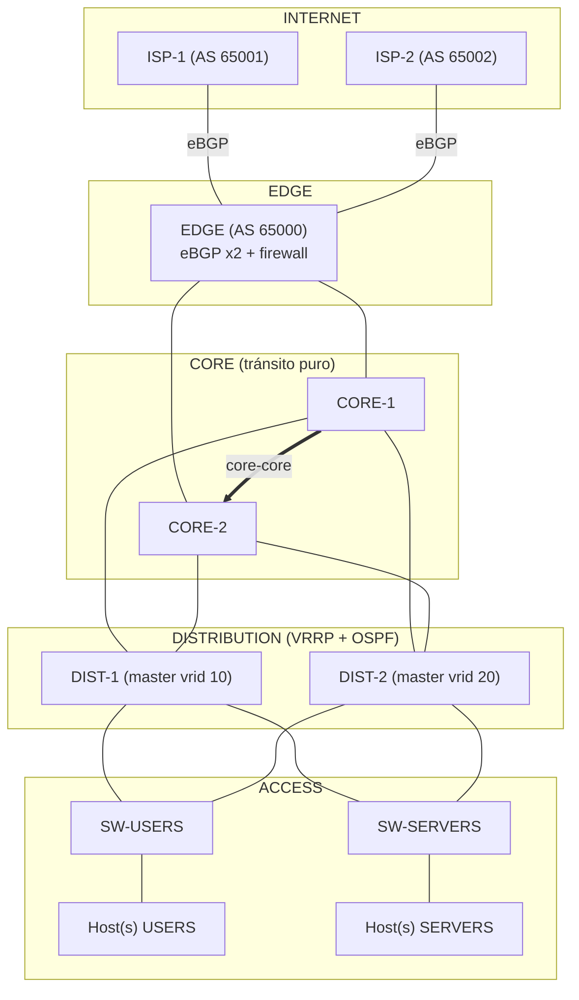

# Topología corregida — Failover Routing

Diagrama de las 5 capas con las correcciones aplicadas (ver `docs/memoria.md` sección 1): enlace core-core agregado, VRRP movido a distribución, core como tránsito puro, eBGP sin Route Reflector.

**11 nodos · 15 enlaces · 7 routers CHR**, igual a lo especificado en la consigna (sección 4). El detalle de IPs de cada enlace está en `docs/memoria.md` sección 2.
